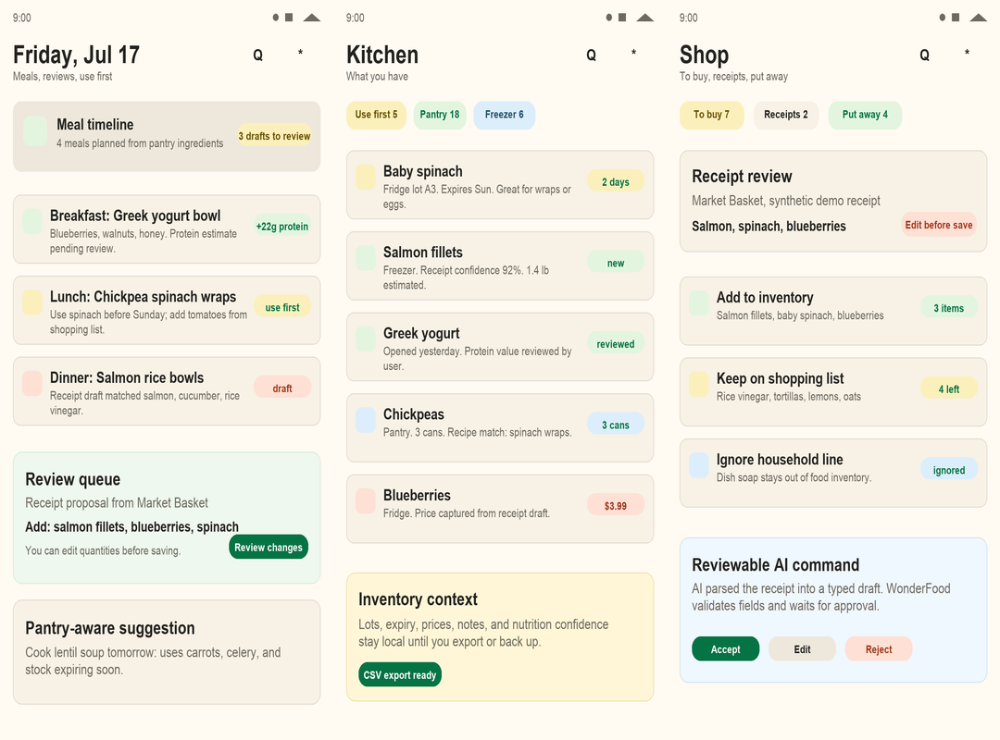
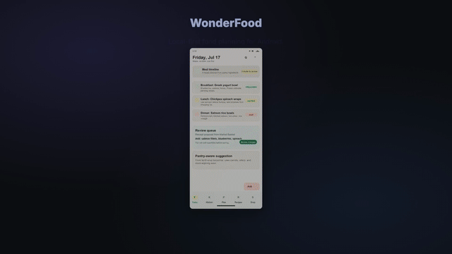

# WonderFood

Local-first food planning for Android: kitchen inventory, recipes, meal plans, shopping, receipts, and reviewable AI proposals in one private workspace.

[](LICENSE)
[](app/build.gradle.kts)
[](app/build.gradle.kts)
[](PRIVACY.md)



## Demo



## Why It Exists

Food apps usually split your life into separate places: pantry lists, recipes, meal logs, shopping, receipts, nutrition, and AI chats. WonderFood keeps them in one local workspace and treats every AI/share/deep-link mutation as a draft you can edit, accept, or reject.

## Highlights

- **Kitchen inventory:** fridge, freezer, pantry, lots, expiry, prices, notes, images, and nullable nutrition.
- **Meal workspace:** daily meal timeline, meal plans, recipe matching, meal logs, and use-first prompts.
- **Shopping and receipts:** manual lists, receipt evidence, deterministic receipt parsing, and put-away review.
- **Reviewable AI:** provider output maps to typed command envelopes; app validation owns every write.
- **No-LLM fallbacks:** manual forms, CSV import/export, deterministic parsing, and command links work without an in-app LLM.
- **External commands:** Android shares, HTTPS/custom-scheme links, and explicit command intents stage bounded proposals.
- **Optional integrations:** encrypted Google Drive app-data backup and Health Connect support can be enabled by the user.

## Product Principles

- Food data stays on-device unless the user explicitly invokes an external provider, encrypted backup, export, or share.
- AI, assistant, share, and deep-link mutations are proposals. The user can edit, accept, or reject them before persistence.
- Unknown nutrition remains unknown. Provider estimates retain source and confidence.
- External bulk proposals are bounded, validated, audited, and applied atomically.
- No personal pantry, account, receipt, health, credential, or provider data is bundled.

Product status lives in [FEATURES.md](FEATURES.md), release order in [ROADMAP.md](ROADMAP.md), and user-visible changes in [CHANGELOG.md](CHANGELOG.md).

## Build

Requirements: JDK 17 and Android SDK 36.

```bash
git clone https://github.com/vaddisrinivas/wonderfood.git
cd wonderfood
./gradlew :app:assembleFossDebug :app:testFossDebugUnitTest
```

Play-integrated debug build:

```bash
./gradlew :app:assemblePlayDebug
```

Install on a connected device or emulator:

```bash
./gradlew :app:installFossDebug
```

Full local quality gate:

```bash
./scripts/quality/android-harness.sh local
```

Connected Android tests:

```bash
./scripts/quality/android-harness.sh connected
```

## Optional Integrations

- AI providers are configured as a deterministic Primary and one optional Fallback. Each request tries Primary once, then Fallback only after failure; there is no rotation or load balancing.
- Google Drive app-data backup is available in the `play` flavor and requires replacing `google_web_client_id` in `app/src/main/res/values/google_auth.xml` with a public OAuth web client ID.
- Health Connect access is available in the `play` flavor and requested through Android's permission flow.
- HTTPS app links require a deployed `https://wonderfood.app/.well-known/assetlinks.json`.
- Other apps can stage commands with links, Android shares, or the explicit command intent documented in [docs/app-command-contract.md](docs/app-command-contract.md).

## FOSS Distribution

WonderFood is Apache-2.0 and local-first, with Fastlane metadata and screenshots prepared under [fastlane/metadata/android/en-US](fastlane/metadata/android/en-US). The `foss` flavor builds without Google Identity, Play Services Auth, or Health Connect SDK dependencies; the `play` flavor keeps Google Drive backup and Health Connect integrations. Distribution notes and disclosure drafts live in [docs/distribution/FOSS_READINESS.md](docs/distribution/FOSS_READINESS.md).

## Modules

- `app`: Compose UI, Android integrations, command/deep-link intake, local SQLite runtime, import/export, and sync UI.
- `core:model`: canonical food domain and snapshot contracts.
- `core:engine`: validated command execution policies.
- `core:data`: Room repository and migration foundation.
- `core:ai`: versioned structured proposal envelopes and provider boundaries.

The runtime app currently uses its audited SQLite store while the canonical core modules remain independently tested boundaries. Keep contract changes synchronized across both paths.

## Privacy and Security

See [PRIVACY.md](PRIVACY.md) and [SECURITY.md](SECURITY.md). Android automatic backup is disabled; WonderFood's explicit backup flow encrypts archives before upload. Cleartext networking is denied except emulator/local-development loopback hosts.

## Contributing

See [CONTRIBUTING.md](CONTRIBUTING.md). Device screenshots, accessibility feedback, food-domain test cases, and import/export edge cases are especially useful.

## License

WonderFood is licensed under [Apache-2.0](LICENSE).
